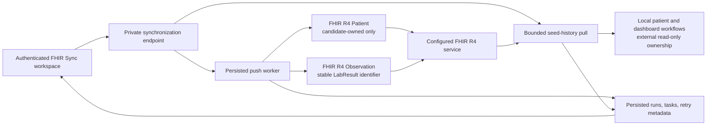

# PulseTrack

PulseTrack is a clinician-managed remote patient monitoring application.

## Current status

Tier 1 includes clinician authentication, patient management, DSMA-8 delivery
and public completion, partial CSV lab importing with validation reports, and
patient and clinic dashboards. Tier 2 includes the server-only FHIR client,
patient and Observation push synchronization, bounded seed-data pull, retries,
and clinician sync status views. Patients do not have application accounts.
AI features are not implemented.

The recommended stable Observation identifier namespace is
`https://challenge.capadev.dev/pulsetrack/lab-result`. It identifies immutable
local LabResult UUIDs, remains independent of a deployment hostname, and
therefore supports idempotent conditional Observation creation.

## Requirements

- Node.js 20.19 or newer
- npm
- Docker Desktop or another Docker installation with Compose

## Under-ten-minute local setup

From PowerShell in the repository root, run this copy-pasteable sequence. The
migration deploy command is intentionally non-interactive.

```powershell
npm install
Copy-Item .env.example .env
npm run db:up
npm run dev
```

Open `http://localhost:3000` and sign in with the startup clinician declared in
`prisma/seed-data/admin-user.json`. On macOS or Linux, replace `Copy-Item
.env.example .env` with `cp .env.example .env`.

The `npm run dev` and `npm start` commands use the shared startup launcher,
which completes `npm run bootstrap` before launching Next.js. It validates the
Prisma schema, generates Prisma Client, deploys pending migrations, runs the
complete idempotent reference-data seed, and provisions the startup clinician.
Existing migrations, seed rows, and the clinician account are reported and
treated as success. The Vercel build uses the same launcher before compiling
Next.js.

After bootstrap, `npm run dev` starts both Next.js and the local
scheduled-assessment worker. The worker loads `.env.local` before `.env`, runs
one check immediately, then checks for due assessments once per minute. It uses
the same idempotent delivery service and email configuration as the protected
HTTP job.

The committed bootstrap credentials are intended only for the requested
initial account. Change the password before exposing a deployment publicly.

The example environment is immediately usable with the Compose database. Before
using email delivery or any non-local deployment, replace `AUTH_SECRET`,
`SCHEDULER_SECRET`, `SENDGRID_API_KEY`, and `ASSESSMENT_EMAIL_FROM`. Only
`NEXT_PUBLIC_APP_URL` may be exposed to browser bundles.

## Deploying from GitHub to Vercel

Import the GitHub repository into Vercel as a Next.js project. The committed
`vercel.json` runs Prisma Client generation before the production build.

Create a managed PostgreSQL database that is reachable from Vercel, then add
every variable listed in `.env.example` under **Project Settings → Environment
Variables**. Use separate values for Production, Preview, and Development when
appropriate:

- `DATABASE_URL` must be the managed database connection string. Prefer the
  provider's pooled runtime URL when one is available.
- Generate unique values of at least 32 characters for `AUTH_SECRET` and
  `SCHEDULER_SECRET`. Also set `CRON_SECRET` for Vercel cron invocations; it may
  use the same value as `SCHEDULER_SECRET`.
- Set `NEXT_PUBLIC_APP_URL` to the deployed HTTPS origin.
- Add SendGrid and FHIR variables only when those integrations are enabled.

Do not upload or commit `.env` or `.env.local`. Those files are intentionally
ignored because Git history is not a secret store; `.env.example` is the
deployable variable manifest.

The Vercel build applies migrations, seeds reference data, and provisions the
startup clinician against the configured deployment database. The same
idempotent sequence can be run manually:

```powershell
$env:DATABASE_URL="<managed-production-database-url>"
npm run bootstrap
```

To provision only the committed startup clinician:

```powershell
npm run clinician:bootstrap
```

## Local PostgreSQL

Start the PostgreSQL 17 development database:

```bash
npm run db:up
```

Check its container health and stop it without deleting its data:

```bash
npm run db:status
npm run db:down
```

Application code running directly on Windows connects to PostgreSQL through
`localhost:5433`. A future application container on the Compose network would
connect through the service hostname and port `db:5432`.

The database uses a persistent Docker volume. Running
`docker compose down -v` permanently deletes the local PulseTrack database
volume and all data stored in it.

## Prisma workflow

Format and validate the Prisma schema, then regenerate the ignored Prisma
Client:

```bash
npm run prisma:format
npm run prisma:validate
npm run prisma:generate
```

Use development migrations while changing the schema locally:

```bash
npm run db:migrate
npm run db:migrate:status
```

`prisma migrate dev` creates and applies migrations during development.
Committed migrations are applied to an empty or deployment database with:

```bash
npm run db:deploy
```

`prisma migrate deploy` only applies existing committed migrations. The project
uses migrations as its reproducible database history; `prisma db push` is not
the normal migration workflow.

Seed the immutable DSMA-8 questionnaire and supported lab-test catalog after
applying migrations:

```bash
npm run db:seed
```

The seed is idempotent. It rejects conflicting questionnaire version `1.0` or
lab mappings instead of overwriting established reference data.

## Clinician authentication

PulseTrack authenticates clinicians with normalized lowercase email addresses
and Argon2id password hashes. Successful login creates an opaque server-side
session. Only a random session token is sent to the browser in an `HttpOnly`,
`SameSite=Lax` cookie; production cookies also use `Secure`. Sessions expire
after eight hours, are revoked during logout, and are rejected immediately when
the clinician is disabled.

The public authentication routes are `/login`, `/api/auth/login`, and the
idempotent `/api/auth/logout`. The root application page is protected by its
server layout, and private APIs live under `/api/private` and use the centralized
clinician authentication wrapper. There are no patient accounts or patient
authentication flows.

## Authenticated application shell

Authenticated clinicians share one protected responsive shell with destinations
for Patients, Lab Uploads, FHIR Sync, Clinic Dashboard, and Patient Dashboard.

Language and theme preferences use separate first-party cookies:

- `pulsetrack_language`: `en` or `ar`; default `en`
- `pulsetrack_theme`: `light` or `dark`; default `light`

Valid cookies take precedence over the fixed defaults. Invalid or missing values
fall back deterministically to English and light mode. Both cookies are
`HttpOnly`, `SameSite=Lax`, scoped to `/`, valid for one year, and `Secure` in
production. The root server layout reads them before rendering and applies the
document language, direction, and theme, so Arabic RTL and dark mode do not rely
on client-only initialization. Logout does not clear these non-sensitive
preferences.

### Create a development clinician

Create the first local clinician with the administrative CLI:

```powershell
npm run clinician:create -- --email clinician@example.local --password "YOUR_SECURE_DEVELOPMENT_PASSWORD" --name "Development Clinician"
```

The command validates and normalizes the email, hashes the password with the
same Argon2id configuration used by login, and creates an `ACTIVE` clinician.
It does not print the password or stored password hash. This remains a local
administrative command; PulseTrack does not expose a registration page or
account-creation API.

## Patient management

Authenticated active clinicians can list, create, view, edit, and archive
patient records under `/patients`. Editable fields are MRN, first name, last
name, date of birth, biological sex, required email, and optional phone.

One shared Zod module validates browser and API input. MRNs are trimmed and
uppercased, emails are required, trimmed, and lowercased, blank phone values
become `null`, and future or invalid calendar dates are rejected. PostgreSQL’s
existing unique MRN constraint remains authoritative; normalized conflicts
return a safe `409` field error.

Archive is a soft delete through the existing `archived_at` column. The default
list queries only rows where `archived_at IS NULL`, while archived records
remain available by direct detail URL. Create, changed update, and first archive
mutations write clinician-attributed entries to the existing `audit_logs` table
inside the same Prisma transaction. No patient accounts, passwords, sessions,
or login routes exist.

The patient list uses URL parameters for server-side search, FHIR-state
filters, and pagination. Supported parameters are `search`, `origin`,
`ownership`, `syncStatus`, `page`, and `pageSize`; defaults are an empty search,
all enum states, page `1`, and page size `10`. Page sizes are limited to `10`,
`25`, or `50`. Multi-word search requires every token to match MRN, first name,
or last name in PostgreSQL. Results are ordered by last name, first name, MRN,
then patient ID. Source, ownership, and sync badges display the stored Prisma
enum values without live FHIR calls. Send opens an accessible dialog on the
current patient view and submits to the authenticated assessment-delivery
endpoint. Scheduling controls are not exposed in the clinician UI. Direct
legacy action URLs redirect to the patient detail page.

Patient MRNs link to active-only detail routes at `/patients/[patientId]`,
where `patientId` is an opaque UUID rather than PHI. The detail page shows
demographics, safe FHIR state badges, and assessment history ordered
by creation time newest first. Completed DSMA-8 entries display the stored total
score and risk band; the score maximum comes from the immutable questionnaire
definition. The route never selects assessment tokens, recipient addresses,
answers, scoring snapshots, provider errors, or internal assessment IDs.
Delivery failure is exposed only as a safe derived state. Archived and unknown
identifiers use the protected localized not-found state.

### Assessment delivery

Clinicians can send the active DSMA-8 assessment immediately from either the
patient list or patient details. The focus-trapped, keyboard-accessible dialog
shows the patient recipient and explains the single-use link. Closing it has no
side effect. Scheduling controls are currently not exposed, but the server-only
delivery worker remains available to process existing queued or retry records
with:

```bash
npm run assessments:deliver-due
```

Configure the server-only `SENDGRID_API_KEY` and `ASSESSMENT_EMAIL_FROM`
variables documented in `.env.example`. Production schedulers may call
`POST /api/scheduled/assessments` with `Authorization: Bearer <scheduler-secret>`;
configure the server-only `SCHEDULER_SECRET` with at least 32 random characters.
The repository also includes a five-minute GitHub Actions cron. Configure
repository secrets named `PULSETRACK_APP_URL` and `SCHEDULER_SECRET` to enable
it. A daily Vercel Hobby-compatible safety run is registered in `vercel.json`;
Vercel calls the `GET` handler using its `CRON_SECRET` bearer header.
The endpoint and CLI invoke the same delivery-and-expiry job. PostgreSQL
transaction-scoped advisory locks serialize each assessment delivery, and a
stable provider idempotency key protects interrupted retries. Temporary
delivery failures are retried after five minutes, at most three times, and only
within 24 hours of the requested schedule so stale patient messages are not
sent unexpectedly. Each delivery uses a cryptographically random token and
stores only its SHA-256 hash. The raw token exists only in the patient link
passed to the email provider; it is never returned by the API or written to
logs or audit metadata. Confirmed sends set `sent_at` and an expiry exactly
seven days later. Every success or failure creates a delivery-attempt row
containing only controlled provider metadata and sanitized errors.

Automated assessment tests always inject a mocked email sender and never contact
SendGrid:

```powershell
npm run test:assessments:integration
npm run test:tier1:e2e
```

The emailed `/assessment/[token]` route exchanges a valid raw token
server-side for a short-lived signed `HttpOnly` access cookie and removes the
raw token from the browser URL. The public `/assessment` page renders all eight
questions and answer options from the immutable stored questionnaire JSON.
Submission validates the exact stored item and option sets and derives the sum
and risk band from the stored scoring bands. A conditional assessment update,
response insert, and audit entry run in one transaction; the unique response
constraint remains the database backstop against duplicate responses.

### Lab CSV upload shell

Authenticated clinicians can download the exact `lab-results-template.csv`
project template and upload CSV files from `/lab-uploads`. The protected upload
endpoint accepts non-empty `.csv` files up to `LAB_CSV_MAX_BYTES` (5 MiB by
default) and requires the template header row in its exact order. Each upload
creates a clinician-scoped `PROCESSING` record, then a shared server service
trims and normalizes every row, validates active MRNs and supported catalog
codes, and records accepted, rejected, or duplicate outcomes. Valid rows are
inserted even when other rows fail. The database identity of patient, collection
date, and test code prevents duplicate results across retries and corrected
re-uploads. Raw CSV files are not retained; only safe filename metadata, a
SHA-256 digest, normalized row results, and stable validation codes are stored.
Accepted results enqueue idempotent FHIR Observation synchronization when the
optional server-only FHIR configuration is available.

Collection dates accept canonical `YYYY-MM-DD`, year-first `YYYY/M/D`, and
month-first spreadsheet forms such as `M/D/YYYY` or `M-D-YYYY`. All accepted
forms are validated as real, non-future calendar dates and normalized to
`YYYY-MM-DD` before duplicate checks and storage. Lab-result inserts, validation
rows, and FHIR queue entries are batched to keep larger uploads responsive.

Each upload-history filename links to the clinician-scoped validation detail at
`/lab-uploads/[importId]`. The detail page presents every stored source row in
CSV order and supports URL-backed `accepted`, `rejected`, and `duplicate`
filters. Its protected report endpoint returns a deterministic CSV containing
one summary record followed by one record per source row, including normalized
values, stable codes, fields, and localized readable messages.

### Dashboards

`/dashboard/patient` uses an opaque patient UUID in URL state and charts
fasting glucose, HbA1c, optional systolic blood pressure, and completed DSMA-8
scores. `/dashboard/clinic` aggregates active patients, assessment outcomes,
latest patient risk, and clinician-scoped lab-import quality over a validated
date range.

## FHIR R4 integration

The protected `/fhir-sync` workspace is the primary clinician entry point for a
manual synchronization. Its prominent **Synchronize FHIR data** action processes
persisted Patient and Observation push tasks, makes eligible failures immediately
retryable, and then performs the bounded historical pull for the provided seed
MRNs. Run cards distinguish pushed clinic data from imported clinical history
and show discovered, successful, failed, and skipped totals. Configuration,
latest outcome, current `RUNNING` state, and sanitized retry availability remain
visible without exposing resource identifiers or patient data.



All five required FHIR settings are resolved together. With none present, FHIR
is safely disabled; a partial configuration stops startup with only missing
environment-variable names. Credentials and the candidate identifier are
server-only. Automated tests inject a mocked client and never call the shared
FHIR service.

## Scheduled assessment execution

Run due delivery and expiry processing locally with:

```powershell
npm run assessments:deliver-due
```

External schedulers can call `POST /api/scheduled/assessments` with
`Authorization: Bearer <SCHEDULER_SECRET>`. Never place the scheduler secret in
a URL, browser script, or committed file. Local `npm run dev` starts a
once-per-minute cron worker automatically. In production, configure the GitHub
repository secrets described above and set `CRON_SECRET` in Vercel.

## Commands

```bash
npm run dev          # Start the development server
npm run build        # Create a production build
npm run start        # Start the production server
npm run lint         # Check code with ESLint
npm run lint:fix     # Fix supported ESLint issues
npm run format       # Format files with Prettier
npm run format:check # Check formatting
npm run db:up        # Start local PostgreSQL
npm run db:status    # Show database container status
npm run db:down      # Stop local PostgreSQL
npm run bootstrap    # Validate, generate, migrate, seed, and provision startup user
npm run clinician:create -- --email <email> --password "<password>" --name "<name>"
npm run clinician:bootstrap # Provision the startup user idempotently
npm run assessments:deliver-due # Deliver scheduled assessments that are due
npm run benchmark:routes # Benchmark authenticated routes against a running server
npm test             # Run the unit test suite
npm run test:auth    # Run clinician authentication unit tests
npm run test:shell   # Run shell, navigation, language, RTL, and theme tests
npm run test:patients # Run patient validation and UI architecture tests
npm run test:patients:task07 # Run patient-list HTTP, browser, RTL, and axe checks
npm run test:assessments # Run assessment validation and security unit tests
npm run test:assessments:integration # Run mocked-provider database tests
npm run test:assessment-job # Run scheduler authorization and history-status tests
npm run test:labs # Run lab-template, upload-validation, and history tests
npm run test:labs:integration # Run lab-import PostgreSQL tests
npm run test:lab-report # Run import-detail and validation-report tests
npm run test:public-assessment # Run public form and scoring unit tests
npm run test:public-assessment:integration # Run single-use PostgreSQL tests
npm run test:patients:task08 # Run patient-detail and patient-list browser checks
npm run test:patient-dashboard # Run patient-dashboard tests
npm run test:clinic-dashboard # Run clinic-dashboard tests
npm run test:tier1:security # Run the Tier 1 security audit
npm run test:tier1:e2e # Run the consolidated mocked-email Tier 1 flow
```

## Source structure

- `src/app`: Next.js App Router pages, layouts, and global styles
- `src/components`: shared UI components
- `src/config`: centralized application configuration and environment validation
- `src/lib`: shared framework-independent utilities
- `src/server`: server-only authentication, patient services, and future domain code
- `src/modules`: domain-oriented architectural placeholders
- `prisma`: database schema, migrations, and reviewed hardening SQL

The domain folders under `src/modules` document boundaries for authentication,
clinicians, patients, questionnaires, lab results, dashboards, notifications,
FHIR, and AI insights. Runtime implementation remains in the App Router,
components, shared libraries, and server-only services rather than a separate
backend application.
